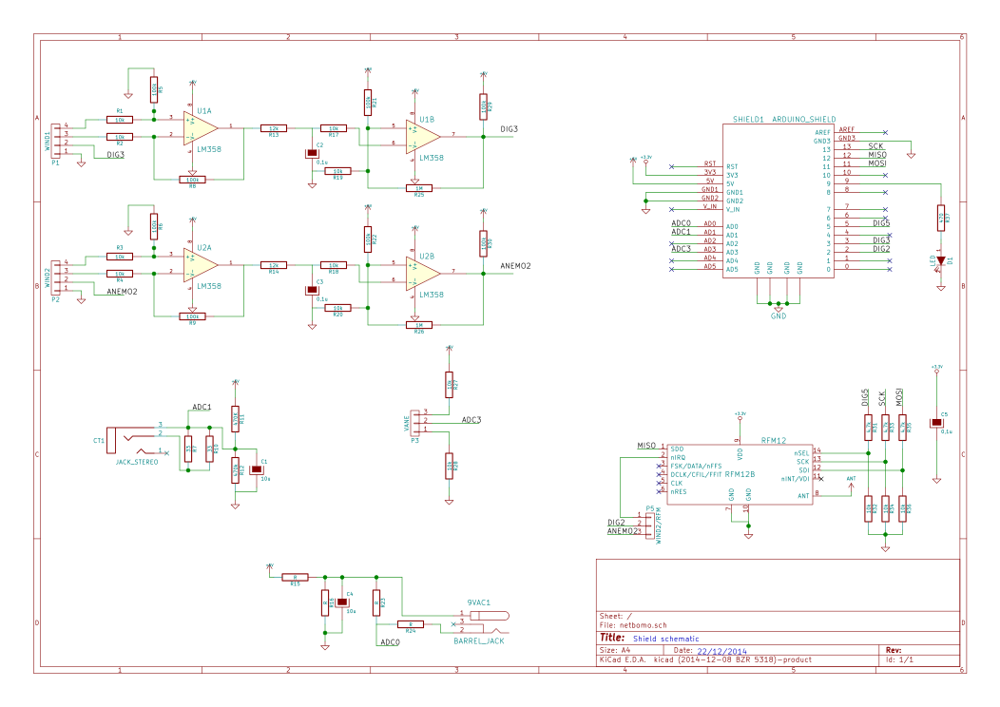
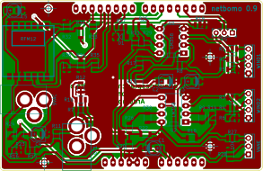

## Lots of bugs on this card, please don't use it!

### Netbomo schematic :

The "WIND1" and the "WIND2" are composed of 2 op-amp circuits :
  - the first one amplifies "sinusoidal" data coming from the NRG-type anemometers
  - the second one convert it to a square wave curve that can be used afterward to count RPMs

### Netbomo board :

